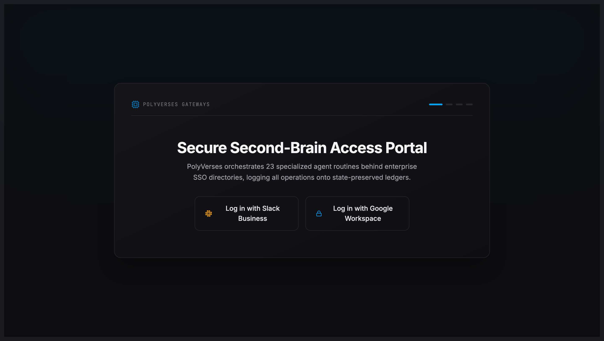

# PolyVerses

**The runtime for [Product Leadership OS](https://github.com/OssamaMokhtar/product-leadership-os): an agent workbench where a PM runs specialist agents and can see which one ran, on what input, and why.**

`TypeScript` · `React` · `Vite` · `Express` · `Firebase` · `Gemini`



*Entry portal. The orchestration console, agent network diagram and observability dashboard sit behind Google sign-in.*

> **Decision, 23 Sep 2026: one product, not three.** Between 11 and 22 Sep this repo was repurposed as the PolySync fitness coach. That code now lives in [PolySync `app/`](https://github.com/OssamaMokhtar/PolySync/tree/main/app), with its history. PolyVerses is back to being the PM workbench, and it no longer keeps its own copy of the skill library: [Product Leadership OS](https://github.com/OssamaMokhtar/product-leadership-os) is the single source for the skills, and PolyVerses is where they run.

---

## What is built

| Surface | State |
|---|---|
| Orchestration console | Runs a staged workflow (opportunity → compliance → PRD → rollback check) with human approval gates between stages |
| Agent calls | One server endpoint (`POST /api/evaluate`) with **5 prompt-specialised agent modes**: router, opportunity (RICE), compliance, PRD, rollback. The larger agent roster shown in the UI is design, not separate running agents |
| Observability dashboard, agent network diagram, prompt console, heatmaps | UI over run logs and agent metadata |
| Persistence | Generated PRDs saved per user in Firestore |
| Security | Gemini key server-side only (CI checks the client bundle); Firestore rules default-deny with ownership and schema checks ([`security_spec.md`](security_spec.md)) |

**Sandbox mode.** Without `GEMINI_API_KEY`, the endpoint returns template text. The console now labels that as "Sandbox output, no model was called" instead of showing it as a run.

## What is not built or measured

- No evaluation of agent output quality. The planned test is 5 PMs × 3 workflows, passing if at least 50% of outputs are used with light edits.
- The Firestore rules tests are a plan, not a suite ([tests/firestore-rules](tests/firestore-rules/README.md)).
- No users, no hosted multi-tenant deployment.
- The "rollback" agent's telemetry is simulated by the prompt; it is not connected to any deployment.

## Run locally

```bash
npm install
cp .env.example .env.local     # add GEMINI_API_KEY for real model calls
npm run dev
```

## CI

Typecheck → build → client-bundle check → `npm audit` (high and critical fail). Every step can fail the build; the previous workflow wrapped each step in `|| echo` or `|| true`.

## Known refactor

`OrchestrationConsole.tsx` is about 2,000 lines and should be decomposed before new agent modes are added.

## Licence

MIT
