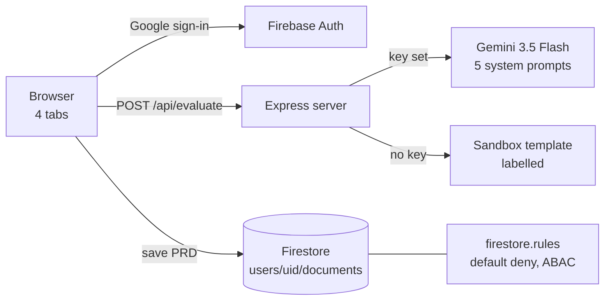

# PolyVerses — System architecture

> Status: AUTHORED · Updated 2026-09-23 · Owner: Ossama Mokhtar

**A React/Vite client, an Express server with one model route, and Firestore behind default-deny rules.** The Gemini key never reaches the browser; CI checks the client bundle for it.

| Component | File | Role |
|---|---|---|
| App shell | `src/App.tsx` | Tabs: workbench, codebase, prompts, observability; auth gate |
| Orchestration console | `src/components/OrchestrationConsole.tsx` (~2,000 lines) | Staged workflow, human gates, undo, logs |
| Agent network | `src/components/AgentNetworkDiagram.tsx` | D3 force graph of agent hand-offs |
| Prompt console | `src/components/PromptConsole.tsx` | View and edit agent prompts |
| Server | `server.ts` | `/api/evaluate`, static hosting, sandbox fallback |
| Firebase | `src/firebase.ts`, `firestore.rules` | Auth and per-user storage |
