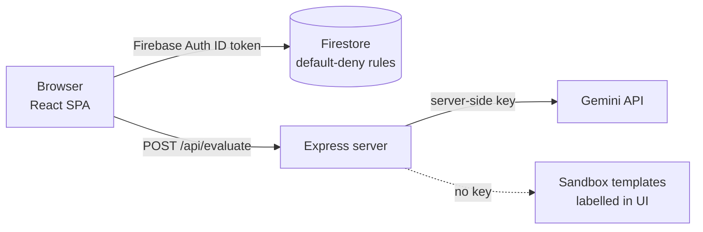

# PolyVerses — Security

> Status: AUTHORED · Updated 2026-09-23 · Owner: Ossama Mokhtar

## Trust boundaries

Two boundaries matter. The browser talks to Firestore directly, so the **rules are the access control**. The browser talks to Gemini only through the server, so the **server is the spend control**.

## Controls and their evidence

| Control | Evidence | Status |
|---|---|---|
| Gemini key server-side only | CI greps the client bundle for the Gemini client or endpoint and fails if found | ✅ Enforced |
| Firestore default-deny, owner-only, verified email, schema checks, server timestamps | [`firestore.rules`](../firestore.rules), [`security_spec.md`](../security_spec.md) | ✅ Written · ⬜ not tested (GAPS #2) |
| Rate limit, body cap, input validation on `/api/evaluate` | `server/guard.ts`, 3 tests in CI | ✅ Enforced (per instance) |
| Sandbox output labelled as "no model was called" | Console UI | ✅ |
| Simulated observability metrics labelled | `ObservabilityDashboard.tsx` | ✅ |
| Dependency audit (high and critical fail) | CI | ✅ |
| Authentication on `/api/evaluate` | — | ⬜ Open (GAPS #3) |

## Open risks, ranked

| Risk | Why it matters | Mitigation |
|---|---|---|
| Anonymous model endpoint | Budget can be spent by anyone who finds the URL; limit is per instance | Verify the Firebase ID token server-side; add a global daily budget that fails closed |
| Prompt injection | User text is placed inside the model prompt without delimiters, so it can override the agent's instructions | Delimit user input, keep instructions in `systemInstruction` only, and add an injection set to the planned eval ([07](07-evaluation.md)) |
| Rules never exercised | A rule typo would open or close data silently | Firestore emulator tests for the 12 "Dirty Dozen" payloads |
| Generated content is shown as-is | Model output is rendered as Markdown | Keep the renderer free of raw HTML |

Vulnerability reports: contact the maintainer directly, not a public issue. Root [SECURITY.md](../SECURITY.md) and [PRIVACY.md](../PRIVACY.md) cover data classification.
